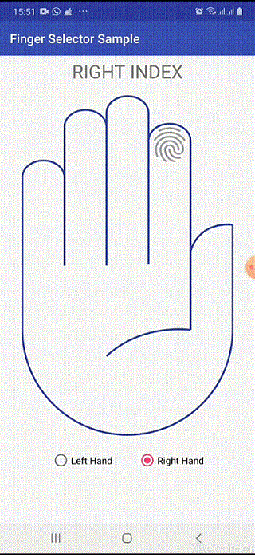

## Finger Selector



- - -

## How to use it? ##

Include the library in your app's build.gradle:

```groovy
    implementation 'com.ugokoli.styroview:fingerSelector:0.1.0'
```  

## Usage

activity_finger_selector_sample.xml
```xml
<?xml version="1.0" encoding="utf-8"?>
<androidx.coordinatorlayout.widget.CoordinatorLayout 
    xmlns:android="http://schemas.android.com/apk/res/android"
    xmlns:app="http://schemas.android.com/apk/res-auto"
    xmlns:tools="http://schemas.android.com/tools"
    xmlns:ugokoli="http://schemas.android.com/apk/res-auto"
    android:layout_width="match_parent"
    android:layout_height="match_parent"
    tools:context=".samples.FingerSelectorSample">

    <androidx.constraintlayout.widget.ConstraintLayout
        android:id="@+id/constraintLayout"
        android:layout_width="match_parent"
        android:layout_height="match_parent"
        app:layout_behavior="@string/appbar_scrolling_view_behavior"
        tools:showIn="@layout/activity_finger_selector_sample">

        <com.ugokoli.styroview.FingerSelector
            android:id="@+id/fingerSelector"
            android:layout_width="match_parent"
            android:layout_height="wrap_content"
            android:layout_marginStart="@dimen/fab_margin"
            android:layout_marginEnd="@dimen/fab_margin"
            android:padding="20dp"

            ugokoli:defaultHand="right"
            ugokoli:defaultFinger="index"

            app:layout_anchor="@+id/constraintLayout"
            app:layout_anchorGravity="center"
            app:layout_constraintEnd_toEndOf="parent"
            app:layout_constraintStart_toStartOf="parent"
            app:layout_constraintTop_toTopOf="parent" />
    </androidx.constraintlayout.widget.ConstraintLayout>

</androidx.coordinatorlayout.widget.CoordinatorLayout>
```


```kotlin
class FingerSelectorSample: AppCompatActivity(), FingerSelector.FingerSelectedListener {
    override fun onCreate(savedInstanceState: Bundle?) {
        super.onCreate(savedInstanceState)
        setContentView(R.layout.activity_finger_selector_sample)

        fingerSelector.fingerSelectedListener = this
    }

    override fun onFingerSelected(hand: Hand, finger: Finger) {
        when (hand) {
            Hand.LEFT -> {
                //TODO: handle action
            }
            Hand.RIGHT -> {
                //TODO: handle action
            }
            else -> { }
        }
       
        when (finger) {
            Finger.THUMB -> {
                //TODO: handle action
            }
            Finger.INDEX -> {
                //TODO: handle action
            }
            Finger.MIDDLE -> {
                //TODO: handle action
            }
            Finger.RING -> {
                //TODO: handle action
            }
            Finger.PINKY -> {
                //TODO: handle action
            }
            else -> { }
        }
    }
}

```
